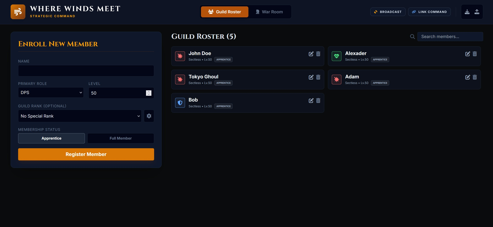
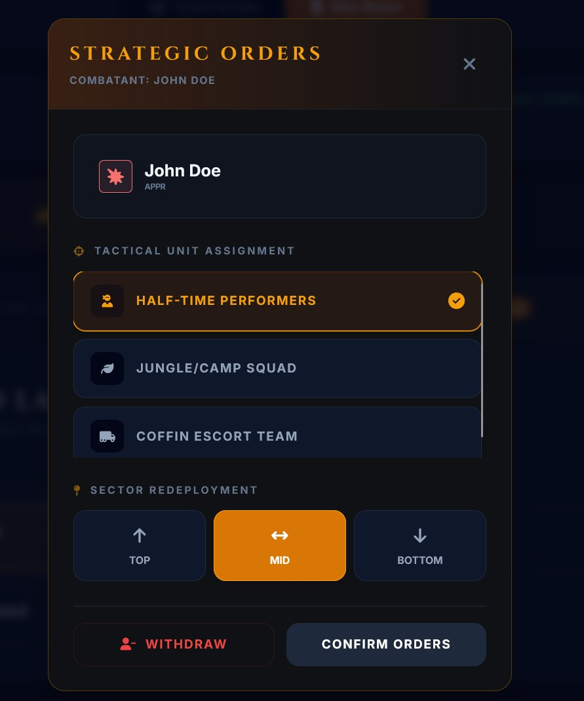

# ⚔️ Where Winds Meet - Guild Strategist

A world-class tactical command center designed for **Where Winds Meet** guild leaders. This application streamlines the management of large-scale guild rosters and coordinates complex 30v30 "Guild War" strategies in real-time.

## 🌟 Core Features

### 1. Roster & Sect Management

Complete lifecycle management for your guild members. Track progress across all 12 major sects (Well of Heaven, Midnight Blades, etc.) and assign custom guild ranks to establish a clear chain of command.

> 

> *The Roster Management view featuring member enrollment and rank customization.*

### 2. GvG War Room (30v30)
The heart of the app. A dedicated strategic interface to plan the perfect deployment across the three primary battle corridors.
*   **Lane Deployment**: Assign exactly 30 players across **Top, Mid, and Bot lanes**.
*   **Visual Balance Stats**: Real-time breakdown of your team composition (Tanks vs. DPS vs. Healers) to ensure lane stability.
*   **Unit Strength Tracker**: A progress bar showing how close you are to the 30-player cap.

> 
> *The Sector Deployment view showing lane-specific combatant assignments.*

### 3. Tactical Units & Specialty Squads
Beyond lanes, coordinate specialized objectives that win games.
*   **Half-Time Performers**: Designate your top 1v1 duelists.
*   **Coffin Escort Team**: Assign heavy tanks and sustain healers to the final payload objective.
*   **Jungle/Camp Squads**: Mobilize mobile units for mini-boss buffs.
*   **Custom Charters**: Commission your own specialty units with custom icons and tactical callsigns.

> 
> *The Tactical Units view where specialty mandates are assigned to combatants.*

### 4. Strategic Link (Real-Time Collaboration)
Powered by **PeerJS**, the strategist can broadcast their screen and live edits to the entire guild.
*   **Commander Mode (Host)**: Full editing permissions. Generate a unique "Command ID" to lead the meeting.
*   **Observer Mode (Viewer)**: Read-only live sync. Guild members join via ID to see assignments happen in real-time without needing an account.
*   **P2P Architecture**: No centralized server; data flows directly between the Commander and the guild.

---

*Created for the Where Winds Meet community. May the winds guide your blade.*

> Vibe Coded with Google AI Studio (Gemini 3 Flash)